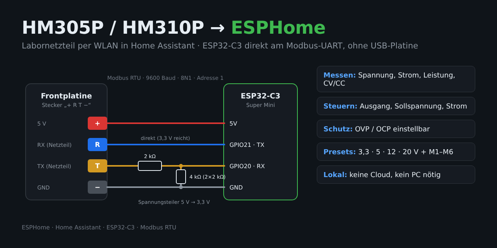

# HM305P / HM310P → ESPHome

**🇬🇧 [English version](README.md)** · 🇩🇪 Deutsch



Hanmatek **HM305P** / **HM310P** Labornetzteil (baugleich mit RockSeed **RS305P/RS310P** und eTommens **eTM-305P/310P**) per WLAN in **Home Assistant**. Lokal, ohne Cloud und ohne PC.

Ein **ESP32-C3 Super Mini** hängt direkt am internen UART des Netzteils, also am 4-poligen Kabel zur Frontplatine. Die originale USB-Platine wird nicht benötigt. Kommuniziert wird per **Modbus RTU** (9600 Baud, 8N1, Adresse 1).

---

## Funktionen

| Bereich | Entitäten in Home Assistant |
|---|---|
| **Messwerte** | Spannung, Strom, Leistung, Betriebsmodus (Aus / CV / CC), Schutzstatus |
| **Steuerung** | Ausgang ein/aus, Sollspannung, Strombegrenzung |
| **Schutz** | OVP- und OCP-Grenzwert einstellbar, OPP-Anzeige |
| **Presets** | 3,3 V · 5 V · 12 V · 20 V · Kurzschlusssuche (1 V / 1 A) |
| **Gerätespeicher** | Buttons „M1 laden“ … „M6 laden“ übernehmen die am Gerät gespeicherten Werte |
| **Sonstiges** | Tastenton ein/aus, Modellkennung, WLAN-Signal |

Alle Presets schalten **zuerst den Ausgang aus** und setzen dann OVP → OCP → Strom → Spannung. Der Ausgang wird bewusst **nicht** automatisch eingeschaltet. Das HM305P bricht beim Ändern der Spannung unter Last kurz ein, siehe [markrages/hm305p_problem](https://github.com/markrages/hm305p_problem).

---

## Hardware

- ESP32-C3 Super Mini (jeder ESP32 mit Hardware-UART geht)
- 3 × Widerstand 2 kΩ (Spannungsteiler)
- etwas Litze

### Verdrahtung

Auf der Frontplatine sitzt neben dem Mikrocontroller (Nuvoton) ein 4-poliger Stecker mit der Beschriftung **„+ R T −“**. Von dort führt ein Kabel zur USB-Platine an der Rückwand, auf der USB-Platine heißen die Pads **V R T G**. Der ESP kommt direkt an dieses Kabel. Die USB-Platine wird abgesteckt.

```
Netzteil (+ R T −)                   ESP32-C3 Super Mini
──────────────────                   ───────────────────
  +  (5 V)  ──────────────────────── 5V
  −  (GND)  ──────────────────────── GND
  R         ──────────────────────── GPIO21 (TX)   direkt
  T         ──[2kΩ]──┬────────────── GPIO20 (RX)
                     │
                   [2kΩ]
                     │
                   [2kΩ]
                     │
  −  (GND)  ─────────┘
```

| Netzteil | Pegel | ESP32-C3 | Hinweis |
|---|---|---|---|
| **+** | 5 V | 5V | versorgt den ESP |
| **−** | GND | GND | gemeinsame Masse |
| **R** | Eingang Netzteil | GPIO21 (TX) | direkt, 3,3 V werden als High erkannt |
| **T** | Ausgang Netzteil, 5 V | GPIO20 (RX) | **nur über Spannungsteiler!** Der ESP32 verträgt keine 5 V |

**Kommt keine Antwort**, sind R und T vertauscht. Dann die beiden Adern tauschen. Der Spannungsteiler muss dabei **immer** an der Ader bleiben, die zu GPIO20 geht.

### Erfahrungen

- **Software-Serial (ESP8266/D1 mini)** hat in meinem Aufbau nicht funktioniert. Mit dem Hardware-UART des ESP32-C3 lief es auf Anhieb.
- **Keine Widerstände in der Sendeleitung (R).** Ein Serienwiderstand dort verhindert, dass das Netzteil die Anfrage erkennt.
- **Messen nur gegen „−“ (GND)** des Steckers, nicht gegen Gehäuse oder Schutzleiter. Die Logikseite ist vom Netz getrennt, gegen Schutzerde misst man Unsinn.
- Die originale USB-Platine arbeitet mit Optokopplern. Wer sie weiter nutzen will, kann den ESP auch anstelle ihres CH340E anschließen. Der direkte Weg ist aber deutlich einfacher.

> ⚠️ **Sicherheit:** Im Netzteil liegt auf der Hauptplatine gleichgerichtete Netzspannung (über 300 V DC). Nur am ausgesteckten Gerät arbeiten und Elkos entladen lassen. Messungen nur an der Frontplatine bzw. am 4-poligen Kabel.

---

## Installation

1. `hm305p-esp32c3.de.yaml` (deutsche Entitätsnamen) in den ESPHome Device Builder kopieren. Mit englischen Namen: `hm305p-esp32c3.yaml`.
2. Die `secrets.yaml` mit den Einträgen aus `secrets.yaml.example` ergänzen. Den API-Key mit `openssl rand -base64 32` erzeugen.
3. Einmal per USB flashen, danach geht alles OTA.
4. Im Log auf Antworten achten. Für die Fehlersuche lässt sich in der YAML der `debug:`-Block unter `uart:` einkommentieren:

```
>>> 01:03:00:10:00:04:45:CC
<<< 01:03:08:00:00:00:00:00:00:00:00:95:D7
```

Kommt nach `>>>` ein `<<<`, steht die Verbindung.

---

## Modbus-Register (Auswahl)

| Register | Inhalt | Faktor | Zugriff |
|---|---|---|---|
| `0x0001` | Ausgang ein/aus | 0/1 | R/W |
| `0x0002` | Schutzstatus (Bits) | – | R |
| `0x0003` | Modellkennung (HM305P = 0x0305, HM310P = 0x0BC2) | – | R |
| `0x0010` | Spannung (Messwert) | ÷100 V | R |
| `0x0011` | Strom (Messwert) | ÷1000 A | R |
| `0x0012–13` | Leistung (32 Bit) | ÷1000 W | R |
| `0x0020` | OVP-Grenzwert | ÷100 V | R/W |
| `0x0021` | OCP-Grenzwert | ÷1000 A | R/W |
| `0x0022–23` | OPP-Grenzwert (32 Bit) | ÷1000 W | R |
| `0x0030` | Sollspannung | ÷100 V | R/W |
| `0x0031` | Strombegrenzung | ÷1000 A | R/W |
| `0x1000 + (n−1)·0x10` | Speicher Mn: +0 Spannung, +1 Strom, +2 Zeit, +3 in Liste | ÷100 / ÷1000 | R |
| `0x8804` | Tastenton | 0/1 | R/W |
| `0x9999` | Modbus-Adresse | – | R |
| `0xA012` | Betriebsmodus: 2 = Aus, 4 = CV, 6 = CC | – | R |

Lesen mit Funktion `0x03`, Schreiben mit `0x06`. Die Bitbelegung des Schutzstatus (`0x0002`) ist geschätzt.

---

## Quellen & Danke

- [flaviutamas.com – RS310P WiFi mod](https://flaviutamas.com/2023/rs310p-wifi-mod): direkter Anschluss ohne USB-Platine
- [markrages/hm305p_problem](https://github.com/markrages/hm305p_problem): Registerliste und Analyse des Spannungseinbruchs
- [thehans/py_test_interface](https://github.com/thehans/py_test_interface/blob/master/hm305.py): erweiterte Registerdokumentation
- [EEVblog-Forum: Power supply ripe for the picking](https://www.eevblog.com/forum/testgear/power-supply-ripe-for-the-picking/)

## Lizenz

MIT, siehe [LICENSE](LICENSE). Nutzung und Umbau auf eigene Gefahr.
