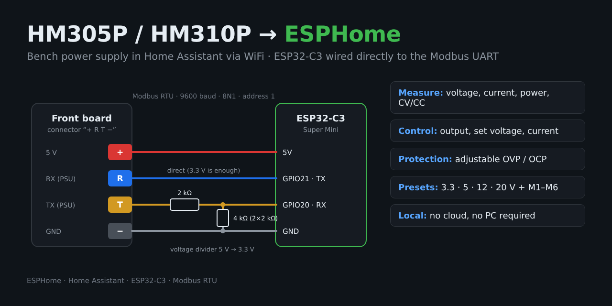
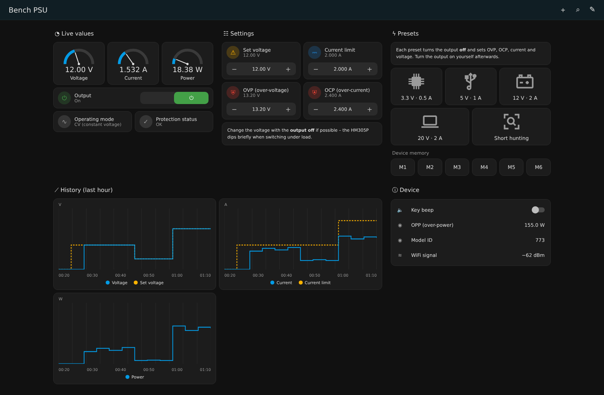
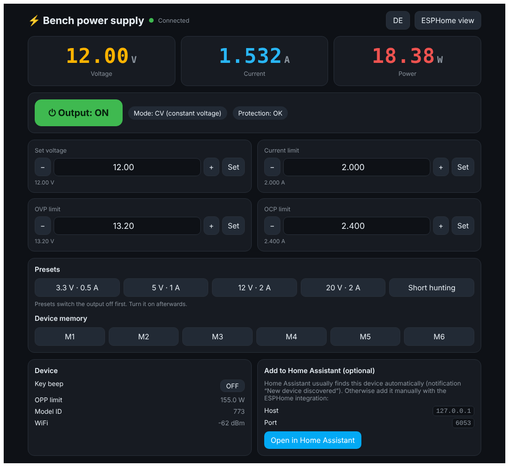

# HM305P / HM310P → ESPHome

🇬🇧 English · **🇩🇪 [Deutsche Version / German version](README.de.md)**

> 🇩🇪 **Alles auch auf Deutsch verfügbar:** Anleitung in [README.de.md](README.de.md), ESPHome-Konfiguration mit deutschen Entitätsnamen in [`hm305p-esp32c3.de.yaml`](hm305p-esp32c3.de.yaml), Dashboard in [`dashboard/dashboard.de.yaml`](dashboard/dashboard.de.yaml), Web-Oberfläche in [`hm305p-esp32c3-webui.de.yaml`](hm305p-esp32c3-webui.de.yaml) und Vorschaubilder in [`images/preview.de.png`](images/preview.de.png), [`images/dashboard.de.png`](images/dashboard.de.png) und [`images/webui.de.png`](images/webui.de.png).



Control a Hanmatek **HM305P** / **HM310P** bench power supply (identical to RockSeed **RS305P/RS310P** and eTommens **eTM-305P/310P**) from **Home Assistant** over WiFi. Fully local, no cloud, no PC required.

An **ESP32-C3 Super Mini** is wired directly to the PSU's internal UART, the 4-pin cable going to the front board. The original USB board is not needed. Communication uses **Modbus RTU** (9600 baud, 8N1, address 1).

---

## Features

| Area | Home Assistant entities |
|---|---|
| **Measurements** | Voltage, current, power, operating mode (off / CV / CC), protection status |
| **Control** | Output on/off, set voltage, current limit |
| **Protection** | Adjustable OVP and OCP limits, OPP readout |
| **Presets** | 3.3 V · 5 V · 12 V · 20 V · short hunting (1 V / 1 A) |
| **Device memory** | "Load M1" … "Load M6" buttons apply the values stored on the PSU |
| **Other** | Key beep on/off, model ID, WiFi signal |
| **Dashboard** | Ready-made Home Assistant dashboard, see [Dashboard](#dashboard) |
| **Web UI** | Standalone firmware with its own web interface, no Home Assistant needed, see [Web UI](#web-ui--without-home-assistant) |

Every preset **turns the output off first**, then sets OVP → OCP → current → voltage. The output is deliberately **not** switched back on automatically: the HM305P briefly dips when the voltage changes under load, see [markrages/hm305p_problem](https://github.com/markrages/hm305p_problem).

---

## Hardware

- ESP32-C3 Super Mini (any ESP32 with a hardware UART works)
- 3 × 2 kΩ resistor (voltage divider)
- some wire

### Wiring

On the front board, next to the Nuvoton microcontroller, there is a 4-pin connector labelled **"+ R T −"**. A cable runs from there to the USB board on the rear panel, where the pads are labelled **V R T G**. The ESP connects directly to this cable. Unplug the USB board.

```
PSU (+ R T −)                        ESP32-C3 Super Mini
─────────────                        ───────────────────
  +  (5 V)  ──────────────────────── 5V
  −  (GND)  ──────────────────────── GND
  R         ──────────────────────── GPIO21 (TX)   direct
  T         ──[2kΩ]──┬────────────── GPIO20 (RX)
                     │
                   [2kΩ]
                     │
                   [2kΩ]
                     │
  −  (GND)  ─────────┘
```

| PSU | Level | ESP32-C3 | Note |
|---|---|---|---|
| **+** | 5 V | 5V | powers the ESP |
| **−** | GND | GND | common ground |
| **R** | PSU input | GPIO21 (TX) | direct, 3.3 V is read as high |
| **T** | PSU output, 5 V | GPIO20 (RX) | **only through the voltage divider!** The ESP32 is not 5 V tolerant |

**No response?** R and T are swapped. Swap the two wires, but the voltage divider must **always** stay on the wire going to GPIO20.

### Lessons learned

- **Software serial (ESP8266/D1 mini)** did not work in my setup. The ESP32-C3's hardware UART worked right away.
- **No resistor in the transmit line (R).** A series resistor there keeps the PSU from recognising requests.
- **Measure only against "−" (GND)** of the connector, not against the chassis or protective earth. The logic side is isolated from mains, so readings against earth are meaningless.
- The original USB board uses optocouplers. If you want to keep it, you can connect the ESP in place of its CH340E, but the direct route is much simpler.

> ⚠️ **Safety:** The main board carries rectified mains voltage (over 300 V DC). Only work on the unplugged unit and let the capacitors discharge. Take measurements only on the front board or the 4-pin cable.

---

## Installation

1. Copy `hm305p-esp32c3.yaml` into the ESPHome Device Builder (German entity names: `hm305p-esp32c3.de.yaml`).
2. Add the entries from `secrets.yaml.example` to your `secrets.yaml`. Generate the API key with `openssl rand -base64 32`.
3. Flash once over USB, then OTA from there on.
4. Watch the log for responses. For troubleshooting, uncomment the `debug:` block under `uart:` in the YAML:

```
>>> 01:03:00:10:00:04:45:CC
<<< 01:03:08:00:00:00:00:00:00:00:00:95:D7
```

If a `<<<` follows each `>>>`, the connection works.

---

## Dashboard



*Example view with sample values.* A ready-made Home Assistant dashboard using only built-in cards (no HACS) is in [`dashboard/dashboard.yaml`](dashboard/dashboard.yaml). The German version is [`dashboard/dashboard.de.yaml`](dashboard/dashboard.de.yaml), preview: [`images/dashboard.de.png`](images/dashboard.de.png).

It contains live gauges, output switch, operating mode (CV/CC), protection status with a warning banner, set voltage / current limit / OVP / OCP with +/− buttons, presets, M1–M6, a one-hour history and device info.

**Add it:** Settings → Dashboards → Add dashboard → *New dashboard from scratch* → open → ⋮ → Edit → ⋮ → *Raw configuration editor* → replace everything → Save.

**Entity IDs:** The dashboard expects the entity IDs that Home Assistant creates for `hm305p-esp32c3.yaml` (device `bench-psu`), e.g. `sensor.bench_psu_voltage`. If you assign the device to an area, Home Assistant may put the area in front (e.g. `sensor.kitchen_bench_psu_voltage`). Check the real IDs under Settings → Devices → *bench-psu* and adjust them with search & replace in the raw editor. For the HM310P, raise the gauge maximum for current to 10 and for power to 300.
---

## Web UI – without Home Assistant



Not using Home Assistant or ESPHome? There is a **standalone firmware with its own web interface**. Open `http://hm305p-xxxxxx.local` (or the IP address) in any browser and control the power supply directly: live V/A/W, output on/off, set voltage, current limit, OVP/OCP, presets and M1–M6. Language switches automatically (EN/DE) and can be toggled.

The Home Assistant files above are **not affected**. The web UI is a separate variant:

| File | Purpose |
|---|---|
| `hm305p-esp32c3-webui.yaml` / `.de.yaml` | ESPHome config: everything from the HA version + web UI, WiFi setup hotspot, no secrets needed |
| `webui/hm305p-ui.js` | The web interface, embedded in the firmware (works offline) |
| Releases → `hm305p-webui-en.factory.bin` / `-de` | Ready-to-flash firmware |

**Install without ESPHome:**

1. Download `hm305p-webui-en.factory.bin` (or `-de`) from the [Releases](../../releases).
2. Connect the ESP32-C3 via USB, open **[web.esphome.io](https://web.esphome.io)** in Chrome/Edge → *Connect* → *Install* → select the `.factory.bin`.
3. After flashing, web.esphome.io offers to set up WiFi directly. Otherwise, connect your phone to the hotspot **HM305P-Setup** and choose your WiFi.
4. Open `http://hm305p-xxxxxx.local` (the suffix is part of the MAC address; see your router for the IP).

**Optional – add to Home Assistant later:** Home Assistant usually finds the device by itself ("New device discovered"). The web UI also shows host and port and has a button to open the ESPHome integration. The [dashboard](#dashboard) works with this firmware too (device name `hm305p-xxxxxx`, adjust the entity IDs).

> The original ESPHome page is still there: button **"ESPHome view"** at the top right. Firmware updates are possible through that page (OTA).
>
> ⚠️ The prebuilt firmware has **no password** on the API or OTA so it works for everyone without configuration. Only use it in your home network. For your own build you can add `encryption:` / `password:` in the YAML.
---

## Modbus registers (selection)

| Register | Content | Scale | Access |
|---|---|---|---|
| `0x0001` | Output on/off | 0/1 | R/W |
| `0x0002` | Protection status (bits) | – | R |
| `0x0003` | Model ID (HM305P = 0x0305, HM310P = 0x0BC2) | – | R |
| `0x0010` | Voltage (measured) | ÷100 V | R |
| `0x0011` | Current (measured) | ÷1000 A | R |
| `0x0012–13` | Power (32 bit) | ÷1000 W | R |
| `0x0020` | OVP limit | ÷100 V | R/W |
| `0x0021` | OCP limit | ÷1000 A | R/W |
| `0x0022–23` | OPP limit (32 bit) | ÷1000 W | R |
| `0x0030` | Set voltage | ÷100 V | R/W |
| `0x0031` | Current limit | ÷1000 A | R/W |
| `0x1000 + (n−1)·0x10` | Memory Mn: +0 voltage, +1 current, +2 time, +3 in list | ÷100 / ÷1000 | R |
| `0x8804` | Key beep | 0/1 | R/W |
| `0x9999` | Modbus address | – | R |
| `0xA012` | Operating mode: 2 = off, 4 = CV, 6 = CC | – | R |

Read with function `0x03`, write with `0x06`. The bit layout of the protection status (`0x0002`) is a best guess.

---

## Sources & thanks

- [flaviutamas.com – RS310P WiFi mod](https://flaviutamas.com/2023/rs310p-wifi-mod): direct connection without the USB board
- [markrages/hm305p_problem](https://github.com/markrages/hm305p_problem): register list and voltage-dip analysis
- [thehans/py_test_interface](https://github.com/thehans/py_test_interface/blob/master/hm305.py): extended register documentation
- [EEVblog forum: Power supply ripe for the picking](https://www.eevblog.com/forum/testgear/power-supply-ripe-for-the-picking/)

## License

MIT, see [LICENSE](LICENSE). Use and modify at your own risk.
